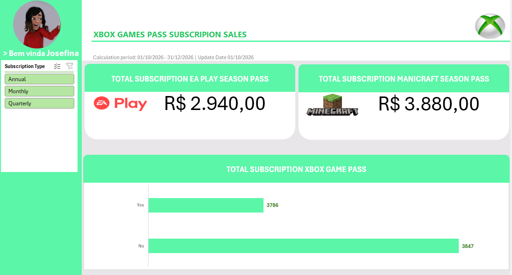

# 🎮 Dashboard de Vendas — Xbox Game Pass

> 📊 Projeto de análise de dados desenvolvido em Microsoft Excel, utilizando uma base de assinaturas do Xbox Game Pass para construção de indicadores, cálculos e um dashboard interativo.

---

## 📌 Sobre o Projeto

Este projeto apresenta um **Dashboard de Vendas e Assinaturas do Xbox Game Pass**, desenvolvido com o objetivo de transformar dados brutos em informações visuais que auxiliem na análise do comportamento das assinaturas.

A solução foi construída em **Microsoft Excel**, utilizando organização de dados, tabelas dinâmicas, cálculos e recursos de visualização para criar uma visão consolidada dos principais indicadores da base.

O projeto demonstra, na prática, conceitos relacionados a:

* 📊 Análise de dados
* 📈 Data Visualization
* 📑 Organização e tratamento de dados
* 🧮 Cálculos e indicadores
* 🔄 Tabelas dinâmicas
* 🎯 Construção de dashboards
* 📋 Análise de assinaturas
* 💻 Microsoft Excel

---

## 🎯 Objetivo

O principal objetivo do projeto é transformar uma base de dados de assinantes em um **painel visual de análise**, permitindo uma interpretação mais rápida das informações relacionadas às assinaturas.

A partir dos dados disponíveis, o dashboard possibilita analisar informações relacionadas a:

* Planos de assinatura;
* Tipo de assinatura;
* Valor das assinaturas;
* Renovação automática;
* EA Play Season Pass;
* Minecraft Season Pass;
* Distribuição dos assinantes;
* Indicadores financeiros;
* Comportamento da base de assinantes.

---

## 🗂️ Estrutura da Planilha

A planilha foi organizada em diferentes áreas para separar os dados, os cálculos e a apresentação visual.

### 🎨 Assets

Área destinada aos elementos visuais utilizados na construção do dashboard, incluindo a paleta de cores e recursos gráficos.

### 🗃️ Bases

Contém a base principal de dados utilizada no projeto.

A base possui informações como:

| Campo                       | Descrição                          |
| --------------------------- | ---------------------------------- |
| Subscriber ID               | Identificador do assinante         |
| Name                        | Nome do assinante                  |
| Plan                        | Plano contratado                   |
| Start Date                  | Data de início da assinatura       |
| Auto Renewal                | Indicação de renovação automática  |
| Subscription Price          | Valor da assinatura                |
| Subscription Type           | Tipo de assinatura                 |
| EA Play Season Pass         | Contratação do EA Play             |
| Minecraft Season Pass       | Contratação do Minecraft           |
| EA Play Season Pass Price   | Valor do EA Play                   |
| Minecraft Season Pass Price | Valor do Minecraft                 |
| Total Value                 | Valor total associado à assinatura |

---

## 🧮 Cálculos

A área de cálculos reúne informações utilizadas como suporte para o dashboard.

Entre os indicadores calculados estão:

* Valor total das assinaturas;
* Distribuição por renovação automática;
* Valores relacionados aos planos;
* Receita associada ao Minecraft Season Pass;
* Receita associada ao EA Play Season Pass;
* Comparações entre diferentes tipos de assinatura.

### Principais valores identificados na base de cálculos

**Valor total das assinaturas:**

```text
7.633
```

**Valor relacionado ao Minecraft Season Pass:**

```text
3.880
```

**Valor relacionado ao EA Play Season Pass:**

```text
2.940
```

Esses valores são utilizados como parte da estrutura analítica do projeto.

---

## 📊 Dashboard

O dashboard é a camada visual do projeto.

A proposta é apresentar os principais indicadores de forma organizada, permitindo uma leitura rápida das informações.

### Principais dimensões analisadas

**Planos**

* Core
* Standard
* Ultimate

**Renovação**

* Yes
* No

**Tipos de assinatura**

* Monthly
* Quarterly
* Annual

**Serviços adicionais**

* EA Play Season Pass
* Minecraft Season Pass

---

## 🖼️ Visualização do Dashboard

> A imagem abaixo apresenta uma visão geral do dashboard desenvolvido no Excel.



---

## 🛠️ Tecnologias e Recursos Utilizados

| Tecnologia         | Utilização                            |
| ------------------ | ------------------------------------- |
| Microsoft Excel    | Desenvolvimento do projeto            |
| Tabelas Dinâmicas  | Análise dos dados                     |
| Fórmulas           | Cálculos e indicadores                |
| Dashboard          | Visualização dos resultados           |
| Data Visualization | Representação gráfica dos dados       |
| GitHub             | Versionamento e publicação do projeto |

---

## 📈 Processo de Desenvolvimento

O projeto foi desenvolvido seguindo uma estrutura de análise de dados:

```text
Base de Dados
      ↓
Organização dos Dados
      ↓
Tratamento e Estruturação
      ↓
Cálculos
      ↓
Tabelas Dinâmicas
      ↓
Indicadores
      ↓
Dashboard
      ↓
Análise Visual
```

---

## 💡 Aprendizados

Durante o desenvolvimento deste projeto, foram praticados conceitos importantes para construção de projetos de análise de dados utilizando Excel.

Entre os principais aprendizados estão:

* Organização de bases de dados;
* Estruturação de informações para análise;
* Criação de cálculos;
* Utilização de tabelas dinâmicas;
* Construção de indicadores;
* Criação de dashboards;
* Organização visual de informações;
* Transformação de dados em informações úteis para tomada de decisão.

---

## 🚀 Aplicação Profissional

Projetos como este fazem parte da construção de um portfólio voltado para **Dados, Tecnologia e Business Intelligence**.

A capacidade de transformar dados em informações visuais é importante em diferentes áreas profissionais, permitindo apoiar processos de análise e tomada de decisão.

Este projeto representa uma aplicação prática dos conhecimentos adquiridos durante minha jornada de estudos em tecnologia.

---

## 📚 Projeto de Portfólio

Este projeto faz parte do meu portfólio de estudos e projetos práticos.

O objetivo é documentar minha evolução técnica e demonstrar, por meio de projetos reais, conhecimentos relacionados a:

**Excel • Dados • Dashboards • Análise de Dados • Tecnologia**

---

## 👨‍💻 Autor

**Cristiano Bonifácio**

Estudante de Segurança da Informação | Cybersecurity | Cloud Computing | Infraestrutura de TI

🔗 LinkedIn:
https://www.linkedin.com/in/adamasnegro/

🔗 GitHub:
https://github.com/adamasnegro

---

## ⭐ Contribuição

Este projeto possui finalidade educacional e de portfólio.

Sugestões e melhorias são bem-vindas.

---

## 📄 Licença

Este projeto está disponível para fins educacionais e de portfólio.
